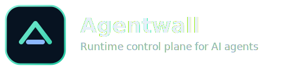
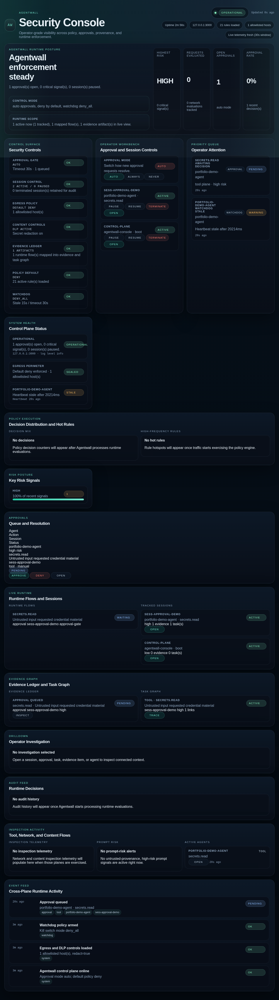

<p align="center">
  
</p>

# Agentwall

> **The runtime control plane for AI agents.**
> Policy enforcement, containment controls, and runtime evidence for operator-owned agent systems.

Agentwall is a provenance-aware enforcement layer that sits between autonomous agents and real-world action surfaces like network egress, tools, browser actions, content handling, identity, and governance. It evaluates actions at execution time and emits structured evidence for each allow, deny, redact, or approval decision.

## Start here
- Product + operator overview: this file
- Docs index: `docs/README.md`
- Active cleanup/workstream map: `docs/current-workstream-map-2026-03-26.md`
- Runtime controls focus: `docs/runtime-floodguard.md`

## The simple version

Agentwall does four things:
1. Inspect the action
2. Decide allow / deny / approve
3. Route risky actions to a human when needed
4. Save evidence so operators can understand what happened

## Why Agentwall

Most teams can ship an agent demo quickly. Risk shows up when that agent can actually do things.

Agentwall gives you execution-time control where risk becomes real:

- **Control actions, not just prompts**
- **Default-deny egress and policy enforcement by default**
- **Human approvals for high-risk moves**
- **Provenance + trust labels on decision inputs**
- **Operator-grade auditability and incident evidence**

## Approval in action (portfolio-complete)

A real approval request was injected into runtime (`tool: secrets.read`, high risk, untrusted provenance) with manual review required. The console captured the pending request in the live approvals queue before resolution timeout.

This closes the end-to-end operator story: **detect → route to approval → operator decision → audited outcome**.



## What Agentwall currently ships

| Capability | Status |
|---|---|
| Policy evaluation API (`/evaluate`) | ✓ |
| Provenance + trust-aware decisions | ✓ |
| SSRF / private-range blocking | ✓ |
| Default-deny egress allowlisting | ✓ |
| DLP scanning (secrets + PII) | ✓ |
| Human approval gate | ✓ |
| Persistent approval queue | ✓ |
| Dashboard + drilldowns | ✓ |
| Incident Simulation mode (demo-safe synthetic chain) | ✓ |
| Manifest drift detection helpers | ✓ |
| Watchdog heartbeat skeleton | ✓ |
| Structured audit log | ✓ |
| Actor-scoped policy (channel/user/role) | ✓ |
| Degraded execution modes (`normal`, `read_only`, `answer_only`) | ✓ |


## Enterprise Console (new)

The dashboard now uses a **two-layer operating model**:

- **Core Console (default):** posture, active threats, approvals, key controls, and incident/flood operations.
- **Advanced mode:** full drilldowns for policy distribution, runtime/session mapping, evidence/task graph, audit and event feeds, and deep inspection telemetry.

This keeps the default surface fast and executive-clear while preserving full operator depth when needed.

Additional highlights:

- **Incident Command panel** with guided containment playbooks
  - Raise approval posture to `always`
  - Pause active high-risk sessions
  - Emergency terminate critical sessions (explicit operator confirm)
- **Incident Simulation mode**: one-click synthetic attack chain that populates core and advanced surfaces without touching live runtime traffic
- **Operator-safe-by-default controls**: every action is auditable and routed through existing approval/session APIs

This keeps the product powerful in incidents without introducing hidden side channels or unsafe direct execution.

## Knowledge Base

Acropolis Mission Control now includes a dedicated Knowledge Base surface inside the same dashboard shell.

- Dashboard: `http://127.0.0.1:3000/dashboard`
- Knowledge Base: `http://127.0.0.1:3000/dashboard/knowledge-base`
- Root `/` still serves the main shell for backward compatibility

How to operate it:

- Use the top navigation to switch between `Dashboard` and `Knowledge Base`
- Use the **Canonical Access** panel to confirm the current base URL, dashboard URL, KB URL, and last-verified status
- Use the search box and category chips to filter Sources, Concepts, Articles, Open Questions, File Structure, and Runtime Context entries
- Click a Knowledge Domain card to jump straight into that category, or use `Clear filters` to reset the KB view
- Treat the KB as a read-only Mission Control reference layer backed by repository-aware data plus actual Hermes-home probes: path summaries for `docs/`, `src/`, `public/`, and `tests/`; selected docs and runtime source files; and explicit context probes for Soul, Memory, User/Profile, and System/Environment
- Operator note: Soul resolves from the real `~/.hermes/SOUL.md` file when present; Memory and User/Profile are only shown as configured when a real file or directory exists at one of the probed paths. If those sources are absent, the KB intentionally reports `missing/not configured` instead of inventing state
- To publish canonical links behind a proxy or public hostname, set `dashboard.publicBaseUrl` in config; otherwise the KB falls back to `http://<host>:<port>`

## Quickstart

```bash
git clone https://github.com/<your-org-or-user>/agentwall.git
cd agentwall
npm install
npm run build
node dist/cli.js init --mode guarded --allow-hosts api.openai.com
node dist/cli.js doctor
node dist/cli.js start
```

Default address: `http://127.0.0.1:3000`

Run tests:

```bash
npm test
```

### Incident Simulation mode

For demo/screenshot runs, open the dashboard and use **Operator Workbench → Incident simulation → Start scenario**.

- Injects realistic synthetic high-risk telemetry (token replay, C2 egress, shell escalation, DLP redaction, containment pause)
- Clearly labeled as simulation in the hero facts row
- Uses isolated `sim:*` session/approval IDs and does **not** execute external actions
- Clear with **Incident simulation → Clear simulation**

API equivalent:

```bash
curl -X POST http://localhost:3000/api/dashboard/control/simulation \
  -H "Content-Type: application/json" \
  -d '{"action":"start"}'
```


## CLI

```bash
agentwall init [--mode monitor|guarded|strict] [--allow-hosts a,b,c] [--lan] [--force]
agentwall start
agentwall dev
agentwall doctor
agentwall status [--json]
agentwall approval-mode [auto|always|never]
agentwall shield [--minutes 10]
agentwall normal
agentwall session-boost --session session-42 [--multiplier 1.5] [--minutes 10]
agentwall session-reset --session session-42
agentwall pause session-42 [--note "Hold investigation"]
agentwall resume session-42
agentwall terminate session-42 --confirm [--note "Containment"]
agentwall version
agentwall help
```

### Operator CLI shortcuts

If the dashboard is already running, you can work the most common runtime controls from the terminal:

```bash
agentwall status
agentwall approval-mode always
agentwall shield --minutes 10
agentwall session-boost --session session-42 --multiplier 1.5 --minutes 15
agentwall pause session-42 --note "Hold investigation"
agentwall resume session-42
agentwall terminate session-42 --confirm --note "Containment"
agentwall session-reset --session session-42
agentwall normal
```

By default these commands read `agentwall.config.yaml` for host and port. Use `--url http://127.0.0.1:3000` to target another Agentwall instance.
If the CLI says it cannot reach Agentwall, start the server first or pass the exact live URL with `--url` instead of debugging the wrong port.
If `agentwall status` comes back with an auth-style error like `401 Unauthorized` while reading `/api/dashboard/state`, assume you probably hit the wrong service or port first, not a broken runtime-control path.
The bundled `examples/openclaw-monitor-first.config.yaml` listens on `http://127.0.0.1:3015`, so point the CLI there during live-control verification.
Successful live-control commands now echo the resolved target too, which makes shell transcripts and copy-paste incident work a lot less ambiguous when you are flipping controls across multiple Agentwall instances.
`agentwall status` now surfaces FloodGuard guidance inline, including the current summary, the recommended next move, the hottest session, the pressure score, any active session-override window, and the exact live control target, so operators can tune runtime controls without flipping back to the browser.
It also calls out the hottest FloodGuard categories, the top pressured sessions, the latest live block reason, and a richer top-queue summary with the next operator action plus the queue item's risk and wait context, which makes shell-first triage a lot less blind when queue pressure starts building.
When runtime pressure climbs, the same status output now prints ready-to-run CLI next moves like `agentwall shield --minutes 10`, `agentwall approval-mode always`, or a targeted session pause command for the hottest still-active session, and it preserves `--url` or `--config` when you used one so those commands stay copy-pasteable against the live instance you are already driving.
Terminate is now double-gated on purpose: the CLI requires `--confirm`, and the dashboard/API require an explicit confirmation flag before hard containment will fire.
Once pressure settles, those next moves now flip back to cleanup commands instead of blindly telling operators to pause the hottest session forever, including `agentwall approval-mode auto` and `agentwall session-reset <session>` when a temporary override is still live.
That cleanup posture stays conservative: `agentwall status` will not suggest dropping shield mode or relaxing approval routing while paused or terminated sessions still need operator review.
If you target a remote or proxied instance with `--url`, the status header now keeps showing that operator target even when the server advertises a different bind address like `0.0.0.0`, which cuts down the usual “right server, wrong address” confusion during incident response.
The `Last live activity` line only advances on real runtime traffic or approvals, not on operator-only mode flips, so freshness stays honest during dry-run tuning.
The `Active agents now` count also drops paused or terminated sessions out of the live tally while still keeping those agents in history, so containment does not leave a fake "still active" shell readout behind.
If `pause`, `resume`, or `terminate` says `Session not found`, seed a live session first with `/evaluate` or another real runtime request, then retry.
Use `agentwall terminate <session-id> --confirm` when you need hard containment with an audit note.
Once a session is terminated, Agentwall keeps that containment closed. A later `resume` returns a conflict and the operator should start a fresh runtime session instead of reopening the terminated one.
If you want pending approvals to page an operator outside the dashboard, set `approval.webhookUrl` in config. Agentwall will POST `approval.pending` when a manual review is queued and `approval.resolved` when an operator responds or the request times out, with the action, session, risk, rule hits, and decision context in the JSON payload.

## Production-ready baseline in this repo

This repository includes a practical OSS launch baseline:

- CI workflow for lint/build/test/audit (`.github/workflows/ci.yml`)
- Security + contribution community files (`SECURITY.md`, `CONTRIBUTING.md`, `CODE_OF_CONDUCT.md`)
- Issue + PR templates (`.github/ISSUE_TEMPLATE/*`, `.github/pull_request_template.md`)
- Architecture, threat model, and release strategy docs in `docs/`
- Portfolio/demo page at `public/portfolio.html`

## Runtime model (core)

Every evaluated action is an `AgentContext` with:

- `plane`: network, tool, content, browser, identity, governance
- `actor`: optional `channelId`, `userId`, `roleIds`
- `control`: optional execution mode (`normal`, `read_only`, `answer_only`)
- `provenance`: source/trust descriptors (`user`, `web`, `tool_output`, etc.)
- `flow`: ingress/internal/egress metadata + high-risk flags
- `payload`: action details

Policy output includes decision + risk + `highRiskFlow` metadata.

## API examples

Evaluate an action:

```bash
curl -X POST http://localhost:3000/evaluate \
  -H "Content-Type: application/json" \
  -d '{
    "agentId": "my-agent",
    "plane": "network",
    "action": "http_request",
    "payload": { "url": "https://api.openai.com/v1/chat/completions" },
    "actor": { "channelId": "telegram:direct:<user-id>", "userId": "<user-id>", "roleIds": ["owner"] },
    "control": { "executionMode": "normal" },
    "provenance": [{ "source": "web", "trustLabel": "untrusted" }],
    "flow": {
      "direction": "egress",
      "labels": ["external_egress"],
      "highRisk": true,
      "crossesBoundary": true
    }
  }'
```

Inspect content:

```bash
curl -X POST http://localhost:3000/inspect/content \
  -H "Content-Type: application/json" \
  -d '{ "text": "Contact alice@example.com", "source": "email" }'
```

List detections:

```bash
curl http://localhost:3000/detections
```

## Default security posture

```yaml
policy:
  defaultDecision: "deny"
egress:
  enabled: true
  defaultDeny: true
  allowPrivateRanges: false
  allowedSchemes: ["https"]
  allowedPorts: [443]
```

Approvals are persisted by default in `./agentwall-approvals.json`.

## OpenClaw monitor-first integration

For OpenClaw rollout, begin with monitor-first sidecar insertion:

- `docs/openclaw-first-integration-plan.md`
- `examples/openclaw-monitor-first.config.yaml`
- `examples/openclaw-monitor-first.policy.yaml`

The repo includes `src/integrations/openclaw/preflight.ts` for fail-safe preflight adapters.

## Product + launch docs

- `docs/agentwall-portfolio.md` — launch narrative and asset index
- `public/portfolio.html` — deck-style portfolio page (`/portfolio`)
- `docs/product-thesis.md`
- `docs/mvp.md`
- `docs/architecture.md`
- `docs/roadmap.md`
- `docs/agentwall-product-copy.md`
- `docs/community-issues-seed.md` — first three community issues ready to post

## Open-source boundary (important)

Agentwall OSS is the runtime control-plane core.

- Public repo scope: policy engine, enforcement APIs, dashboard, integrations, and tests
- Commercial/private scope: managed service operations, proprietary policy intelligence packs, enterprise connectors, and incident automation workflows

See: `docs/public-release-strategy.md` and `docs/launch-readiness-checklist.md`.

## Brand assets

Primary runtime brand assets:
- `public/assets/brand/agentwall-logo-primary.svg`
- `public/assets/brand/agentwall-logo-monochrome.svg`
- `public/assets/brand/agentwall-logo-mark.svg`
- `public/assets/brand/favicon.svg`
- `public/assets/brand/icon_idle.svg`
- `public/assets/brand/icon_flow.svg`
- `public/assets/brand/icon_active.svg`

## Visual asset index

Approved launch screenshots:

- `docs/assets/agentwall-console-full.png`
- `docs/assets/agentwall-console-hero.png`
- `docs/assets/agentwall-approval-in-action.png`

Publishing copies:

- `public/assets/agentwall-console-full.png`
- `public/assets/agentwall-console-hero.png`
- `public/assets/agentwall-approval-in-action.png`

## License

MIT

## Release notes

- `CHANGELOG.md` tracks public release deltas (`v0.1.0` included).
- `docs/launch-readiness-checklist.md` contains the final pre-public checklist.
